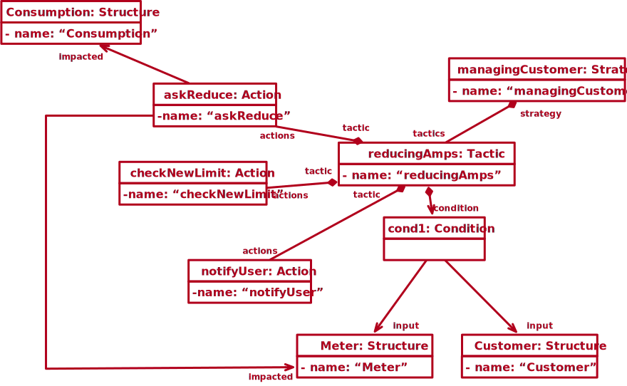

Model Example: SmartGrid at Luxembourg
--------------------------------------

We strongly think that developers need diagnosis support that trace system states to the previous circumstances --targeted requirements, input context-- that had resulted in these decisions.
To tackle this problem, we propose a novel temporal data model to represent, store and query decisions as well as their relationship with the knowledge (context, requirements, and actions).

In this repository, we detailed an example based on the smart grid at Luxembourg.
We describe how to use our solution to diagnose adaptive systems.
We will first describe the example, then the different steps that engineers will have to do to use our approach.
As this approach is a Model-Driven Engineering (MDE), using our approach mainly means instantiating the proposed meta-model.
To show how to instantiate our meta-model, we describe both an object model, a Java code and a LDAS code. The complete object model can be seen [here](https://lmouline.github.io/LDAS/), the Java code [here](src/main/java) and the LDAS code [here](src/main/ldas/smartGrid.ldas).

## Description of the example

The National Institute of Standards and Technology (NIST) defines smart grids as "a modernized grid that enables bidirectional flows of energy and uses two-way communication and **control capabilities** that will lead to a collection of **new functionalities and applications**".
These capabilities, functionalities, and applications can be implemented using approaches developed by the adaptive system community [1].

Hartmann et al., [2] described the smart grid at Luxembourg as a hierarchical system composed of three elements: central system, data concentrator, and smart meter.
Smart meters regularly measure resource consumption (water, gas, or electricity) and report them to the central system through the data concentrator.
A smart meter can also modify the maximal consumption or even cut off the resource.
In addition to storing the consumption data, data concentrators autonomously manage smart meters according to the configuration sent by the central system.

Among the different goals of data concentrators, they have to avoid any overload on the network.
We called it the "*no overload*" policy.
They have two action points: either on the production side or the consumption side.
They can reduce or increase the production by (dis)connecting production unit or the consumption by modifying the maximum permitted consumption.
We called these actions: "*reduce production*", "*increase production*", "*reduce amps limit*" and "*increase amps limit*".
However, as all adaptive systems, smart grids are prone to failures [1].
Using our approach, an engineer could diagnose the system, and determine the adaptation process responsible for this failure.
For instance, considering some reports about regular power cuts during the last couple of days, in a particular area, a stakeholder may want to interrogate the system and determine what past decision(s) have led to this suboptimal state.
More concretely, he will ask:

- **Did the system make any decisions that could have impacted the customer consumption?**
- **If so, what goal(s) the system was trying to reach and what were the values used at the time the decision(s) was(were) made?**


## Introduction

In order to simplify the diagnosis of adaptive systems, we propose a novel metamodel that combines, what we call, design elements and runtime elements.
Design elements abstract the different elements involved in knowledge information to assist the specification of the adaptation process.
Runtime elements instead, represent the data collected by the adaptation process during its execution.
In order to maintain the consistency between previous design elements and newly created ones, instances of design elements (\eg actions) can be either added or removed.
Modifying these elements would consist in removing existing elements and creating new ones.
Combining design elements and runtime elements in the same model helps not only to acquire the evolution of system but also the evolution of its structure and specification (e.g., evolution of the requirements of the system).
Note that, we do not address how runtime information is collected.

## Step 1: Describing the adaptation process at design time

To describe the adaptation process at design time, you can use the [LDAS language](../../language).
Even if we use our language, this can be done using the model API (Java/Javascript/Typescript).
To see how the LDAS language can be mapped to Java/Javascript/Typescript code, please read the [language documentation](../../language).

### Context

Context meta-model can be seen as a data structure of the collected information about the context (any information relevant for the adaptation process).
Defined at designed time, the values will be created and/or updated at runtime.
Here, we describe an object model that instantiates our [context meta-model](../../README.md#graphical-version) and the corresponding Java code.
The full version of the object model can be found [here](https://lmouline.github.io/LDAS/) and the Java program [here](src/main/java/snt/das/model/example/smartgrid/context/ContextGen.java).
The presented object model has been built in accordance with the one described by Hartmann et al. in [2].
Here the presented meta-model by Hartmann et al. in [2]:


In this document, we will depict how to create: the context, one structure (entity), one of its attributes, [...] (**TODO**).

**Creation of the context**:

<!--  -->

Java code:
```
context SmartGridCtx {
}
```

**Creation of one abstract structure**:

<!--  -->

Java code:
```
context SmartGridCtx {
    fragment Entity {

    }
}
```

**Creation of one structure**:

```
context SmartGridCtx {
    ...

    structure Location {

    }
}
```

**Creation of one attribute and one relation**:

<!--  -->

```
context SmartGridCtx {
    fragment Entity {
        const id: string
        const serialNumber: string
        temporal communicationActive: boolean

        rel location: Location
    }

    structure Location {
        const address: string
        const gpsLatitude: string
        const gpsLongitude: string
    }
}
```

**Creation of a source**:

<!--  -->

```
context SmartGridCtx {
    ...

    structure Location {
        const address: string {
            source "Human"
        }

        ...
    }
}
```

**Creation of an uncertainty**:

<!--  -->

```
context SmartGridCtx {
    ...

    structure Location {
        const address: string {
            source "Human"
            uncertainty 0.9
        }

        ...
    }
}
```

**WARNING: Following: previous version**

 ### Actions

 The Action meta-model provides a high vision of the different possible actions <s>possible on the system</s>.
 Actions can be either automatic (e.g., simple API, scripts, etc.)  or manual (e.g. the intervention of a technician <s>at a customer place</s> to install a new meter).
 The action meta-model should not describe in details the different actions.
 It can be see as a catalog of actions.
 Some parts of this meta-model can be automatically created by analysing the code of the different actions. *Amine* **should be more precise! Otherwise omit this sentence**

 Here we describe an object model that instantiates our [action meta-model](../../README.md#graphical-version) and the Java code.
 The full version of the object model can be found here (**TODO**) and the Java program [here](src/main/java/snt/das/model/example/smartgrid/action/ActionGen.java).

 The different actions that we have in our example are:

 - reducing the amps of one or several customers
 - cutting off resource of one or several customer places
 - modifying/adding/removing a repeater for a smart meter (local action)
 - adding/removing cables
 - modifying cable
 - fixing cable

 **Creation of strategies:**

 

 ```java
 Tasks.newTask()
   .createTypedNode(Strategy.META.name)
   .setAttribute(Strategy.NAME.name, Strategy.NAME.type, "managingCustomer")
   .updateIndex(Strategies.META.name)
   .setAsVar("strategy");
 ```

 **Creation of tactics:**

 

 ```java
 Tasks.newTask()
   .createTypedNode(Tactic.META.name)
   .setAttribute(Tactic.NAME.name, Tactic.NAME.type, "reducingAmps")
   .setAsVar("tactic")
   .readVar("strategy")
   .addVarTo(Strategy.TACTICS.name, "tactic")
 ```

 **Creation of conditions:**

 

 ```java
 Tasks.newTask()
   .createTypedNode(Condition.META.name)
   .setAsVar("condition")
   .readVar("tactic")
   .addVarTo(Tactic.CONDITION.name, "condition")
   .readIndex(Contexts.META.name)
   .traverse(Context.STRUCTURES.name)
   .setAsVar("allStructures")
   .select((Node node, TaskContext ctx) -> ((Structure)node).getName().equals("Customer"))
   .setAsVar("input")
   .readVar("condition")
   .addVarTo(Condition.INPUT.name, "input")
   .readVar("allStructures")
   .select((Node node, TaskContext ctx) -> ((Structure)node).getName().equals("Meter"))
   .setAsVar("input")
   .readVar("condition")
   .addVarTo(Condition.INPUT.name, "input");
 ```

 **Creation of actions:**

 

 ```java
 Tasks.newTask()
   .createTypedNode(Action.META.name)
   .setAttribute(Action.NAME.name, Action.NAME.type, "askReduce")
   .setAsVar("action")
   .readVar("tactic")
   .addVarTo(Tactic.ACTIONS.name,"action")
   .createTypedNode(Action.META.name)
   .setAttribute(Action.NAME.name, Action.NAME.type, "checkNewLimit")
   .setAsVar("action")
   .readVar("tactic")
   .addVarTo(Tactic.ACTIONS.name,"action")
   .createTypedNode(Action.META.name)
   .setAttribute(Action.NAME.name, Action.NAME.type, "notifyUser")
   .setAsVar("action")
   .readVar("tactic")
   .addVarTo(Tactic.ACTIONS.name,"action")
   .readVar("allStructures")
   .select((Node node, TaskContext ctx) -> ((Structure)node).getName().equals("Consumption"))
   .setAsVar("impact")
   .readVar("action")
   .addVarTo(Action.IMPACTED.name,"impact")
   .readVar("allStructures")
   .select((Node node, TaskContext ctx) -> ((Structure)node).getName().equals("Meter"))
   .setAsVar("impact")
   .readVar("action")
   .addVarTo(Action.IMPACTED.name,"impact");
 ```


 ### Requirements

 Requirement meta-model allows to abstract the different goals of the system.

 **Creation of natures:**

 

 ```java
 Tasks.newTask()
   .createTypedNode(Functional.META.name)
   .setAttribute(Functional.NAME.name, Functional.NAME.type, "functional")
   .defineAsGlobalVar("functional")
   .updateIndex(Natures.META.name);
 ```

 **Creation of a requirement:**

 

 ```java
 Tasks.newTask()
   .createTypedNode(Requirement.META.name)
   .setAttribute(Requirement.NAME.name, Requirement.NAME.type, "balance")
   .updateIndex(Requirements.META.name)
   .setAsVar("requirement");
 ```

 **Creation of goals:**

 

 ```java
 Tasks.newTask()
   .createTypedNode(Goal.META.name)
   .setAttribute(Goal.GOAL.name, Goal.GOAL.type, "The system shall not have a cable in overload")
   .setAsVar("goal")
   .addVarTo(Goal.NATURE.name, "quality")
   .readVar("requirement")
   .addVarTo(Requirement.GOALS.name, "goal")

   .createTypedNode(Goal.META.name)
   .setAttribute(Goal.GOAL.name, Goal.GOAL.type, "The system shall provide enough resources for the current consumption")
   .setAsVar("goal")
   .addVarTo(Goal.NATURE.name, "performance")
   .readVar("requirement")
   .addVarTo(Requirement.GOALS.name, "goal")

   .createTypedNode(Goal.META.name)
   .setAttribute(Goal.GOAL.name, Goal.GOAL.type, "The system shall not loss resources")
   .setAsVar("goal")
   .addVarTo(Goal.NATURE.name, "performance")
   .readVar("requirement")
   .addVarTo(Requirement.GOALS.name, "goal");
 ```


 ### Knowledge

 Knowledge meta-model allows to link the different elements implied in adaptation processes.
 At design time, it can be seen as the root element of the model.
 Its usage will be more important at runtime. *Amine* **The previous remark stands here as well**

 Here we describe an object model that instantiates our [action meta-model](../../README.md#graphical-version) and the Java code.
 The full version of the object model can be found here (**TODO**) and the Java program [here](src/main/java/snt/das/model/example/smartgrid/action/ActionGen.java).

 

 ```java
 Tasks.newTask()
   .createTypedNode(Knowledge.META.name)
   .setAttribute(Knowledge.NAME.name, Knowledge.NAME.type, "SmartGridKnowledge")
   .updateIndex(Knowledges.META.name)
   .setAsVar("Knowledge")
   .readIndex(Contexts.META.name)
   .setAsVar("Contexts")
   .readIndex(Strategies.META.name)
   .setAsVar("Strategies")
   .readIndex(Requirements.META.name)
   .setAsVar("Requirements")
   .readVar("Knowledge")
   .addVarTo(Knowledge.CONTEXT.name, "Contexts")
   .addVarTo(Knowledge.STRATEGIES.name, "Strategies")
   .addVarTo(Knowledge.REQUIREMENTS.name, "Requirements");
 ```


 ## Step 2: Creating procedure to update the model with logging values at runtime

 The second step consists in adding run time values about context modifications, action executions and decisions.

 ### Context

 Here, we wll show how to set consumption data in the context model:

 

 ### Actions

 Let's imagine that the adaptation process decided to reduce the amps of two uses.
 It will thus execute the `reducingAmps` for the two customers, in parallel.
 The action sequence will look like:

 

 In our solution, this will be represented as depicted in the following figure:

 

 ### Knowledge

 In this section, we show you how to model a decision that has been taken by the adaptation process.

 

 ## Step 3: Query the model to diagnose a self adaptive system at runtime

 Based on the model presented above, an engineer will query it in order to diagnose the root cause of a suboptimal configuration.

 Here a implementation of the first query: **What goal(s) the system was trying to reach by executing a tactic?** (Complete version [here](src/main/java/snt/das/model/example/smartgrid/diagnosisAlgo/GetGoals))

 ```java
 Tasks.newTask()
   .inject(tactics)
   .addToVar("tactics")
   .inject(times)
   .addToVar("times")
   .readVar("tactics")
   .forEach(Tasks.newTask()
     .thenDo((TaskContext ctx) -> {
       TaskResult times = ctx.variable(TIMES);
       int idx = ctx.intVar("i");
       long time = (long) times.get(idx - 1);

       ctx.setVariable(TARGET_TIME, time);

       ctx.continueTask();
     })
     .travelInTime("{{" + TIMED_TACTICS + "}}")
   )
   .readVar("timedTactics")
   .traverse(Tactic.CONDITION.name)
   .traverse(Condition.IMPLEMENT.name)
   .addToVar("goals");
 ```


 ## TODO

 - [ ] GreyCat Inspector with the values
 - [ ] Web view with object model


 ## References

 [1] Hartmann, T., Fouquet, F., Klein, J., Nain, G., & Le Traon, Y. (2014, February). Reactive security for smart grids using models@ run. time-based simulation and reasoning. In International Workshop on Smart Grid Security (pp. 139-153). Springer, Cham.

 [2] Hartmann, T., Fouquet, F., Klein, J., Le Traon, Y., Pelov, A., Toutain, L., & Ropitault, T. (2014, November). Generating realistic smart grid communication topologies based on real-data. In Smart Grid Communications (SmartGridComm), 2014 IEEE International Conference on (pp. 428-433). IEEE.
